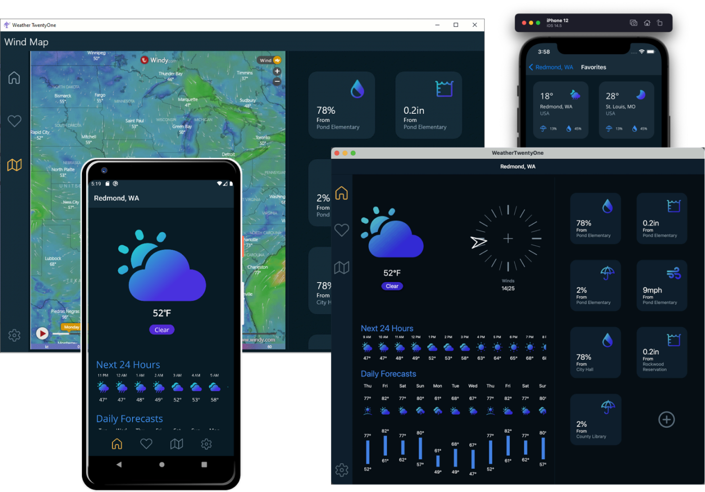
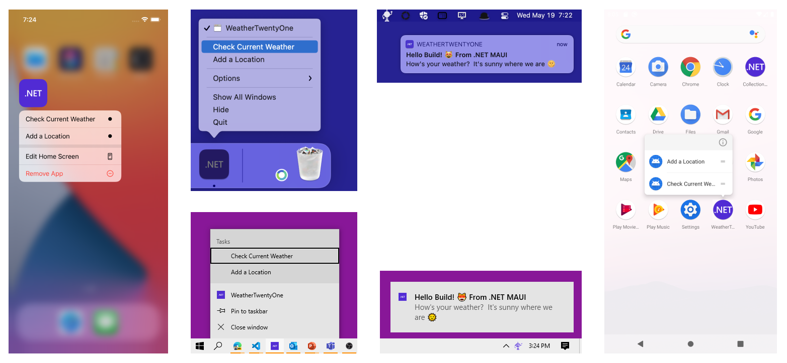

# Weather '21

This is a [.NET MAUI](https://github.com/dotnet/maui) app showcasing responsive UI that adapts to desktop and mobile, and integrates with native platform features. 

## Platform Integrations

To demonstrate how easily you can enable platform-native integrations, we added a handful of features:

* App Actions - Microsoft.Maui.Essentials provides a simple API to add shortcuts you access from the app icon
* System Tray - added the .NET bot to the tray on Windows and status bar on macOS
* Notifications - trigger a notification when clicking the bot

## Four Platforms, One Project

The WeatherTwentyOne project is a multi-targeted SDK project that can run on Android, iOS, macOS, and Windows. 

## Additional Resources

https://docs.microsoft.com/dotnet/maui

https://github.com/dotnet/maui
